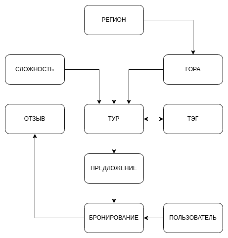

# Альпинистский клуб

**Туроператор, специализирущийся на восхождениях на горы.**

Процессы:

- показ актуальных предложений с подробным описанием тура;
- обработка заявок на восхождения в группах;
- обработка отмены заявки со стороны пользователя;
- показ истории заявок пользователя, а также его активных заявок;
- добавление и удаление пользователями отзывов на туры;
- добавление и удаление администраторами туроператора туров, предложений, тэгов, сложностей и гор.

## Концептуальная модель

На основе анализа предметной области «Альпинистский клуб», были выделены следующие информационные объекты, которые
необходимо хранить в базе данных: `ПОЛЬЗОВАТЕЛЬ`, `РЕГИОН`, `ГОРА`, `ТЭГ`, `СЛОЖНОСТЬ`, `ТУР`, `ОТЗЫВ`, `ПРЕДЛОЖЕНИЕ`,
`БРОНИРОВАНИЕ`.



Рис. 1. Концептуальная схема базы данных «Альпинистский клуб»

## Логическая модель


Рис. 2. Логическая схема базы данных «Альпинистский клуб»

## Физическая модель

В результате проектирования базы данных были получены информационные объекты, реализованные в виде реляционных таблиц.

```sqlite
CREATE TABLE IF NOT EXISTS user
(
    id        INTEGER PRIMARY KEY AUTOINCREMENT,
    login     VARCHAR(30) UNIQUE NOT NULL,
    password  VARCHAR(60)        NOT NULL,
    full_name VARCHAR(100)       NOT NULL,
    phone     VARCHAR(11)        NOT NULL,
    role      TINYINT            NOT NULL
);

CREATE TABLE IF NOT EXISTS region
(
    id   INTEGER PRIMARY KEY AUTOINCREMENT,
    name VARCHAR(255) UNIQUE NOT NULL
);

CREATE TABLE IF NOT EXISTS mountain
(
    id        INTEGER PRIMARY KEY AUTOINCREMENT,
    region_id INTEGER      NOT NULL,
    name      VARCHAR(255) NOT NULL,
    height    SMALLINT     NULL,
    FOREIGN KEY (region_id) REFERENCES region (id) ON DELETE CASCADE ON UPDATE CASCADE
);

CREATE TABLE IF NOT EXISTS difficulty
(
    id     INTEGER PRIMARY KEY AUTOINCREMENT,
    name   VARCHAR(20) UNIQUE NOT NULL,
    rating TINYINT UNIQUE     NOT NULL
);

CREATE TABLE IF NOT EXISTS tag
(
    id   INTEGER PRIMARY KEY AUTOINCREMENT,
    name VARCHAR(20) UNIQUE NOT NULL
);

CREATE TABLE IF NOT EXISTS tour
(
    id                INTEGER PRIMARY KEY AUTOINCREMENT,
    mountain_id       INTEGER             NOT NULL,
    difficulty_id     INTEGER             NOT NULL,
    starting_point_id INTEGER             NOT NULL,
    name              VARCHAR(100) UNIQUE NOT NULL,
    description       TEXT                NULL,
    FOREIGN KEY (mountain_id) REFERENCES mountain (id) ON DELETE RESTRICT ON UPDATE CASCADE,
    FOREIGN KEY (difficulty_id) REFERENCES difficulty (id) ON DELETE RESTRICT ON UPDATE CASCADE,
    FOREIGN KEY (starting_point_id) REFERENCES region (id) ON DELETE CASCADE ON UPDATE CASCADE
);

CREATE TABLE IF NOT EXISTS tour_tag
(
    id      INTEGER PRIMARY KEY AUTOINCREMENT,
    tour_id INTEGER NOT NULL,
    tag_id  INTEGER NOT NULL,
    FOREIGN KEY (tag_id) REFERENCES tag (id) ON DELETE RESTRICT ON UPDATE CASCADE,
    FOREIGN KEY (tour_id) REFERENCES tour (id) ON DELETE RESTRICT ON UPDATE CASCADE
);

CREATE TABLE IF NOT EXISTS offer
(
    id               INTEGER PRIMARY KEY AUTOINCREMENT,
    tour_id          INTEGER  NOT NULL,
    starting_at      DATETIME NOT NULL,
    ending_at        DATETIME NOT NULL,
    max_reservations TINYINT  NOT NULL,
    price            REAL     NOT NULL,
    FOREIGN KEY (tour_id) REFERENCES tour (id) ON DELETE CASCADE ON UPDATE CASCADE
);

CREATE TABLE IF NOT EXISTS reservation
(
    id           INTEGER PRIMARY KEY AUTOINCREMENT,
    offer_id     INTEGER           NOT NULL,
    user_id      INTEGER           NOT NULL,
    reservations TINYINT DEFAULT 1 NOT NULL,
    status       TINYINT DEFAULT 1 NOT NULL,
    FOREIGN KEY (offer_id) REFERENCES offer (id) ON DELETE RESTRICT ON UPDATE CASCADE,
    FOREIGN KEY (user_id) REFERENCES user (id) ON DELETE RESTRICT ON UPDATE CASCADE
);

CREATE TABLE IF NOT EXISTS review
(
    id             INTEGER PRIMARY KEY AUTOINCREMENT,
    reservation_id INTEGER  NOT NULL,
    rating         TINYINT  NOT NULL,
    comment        TEXT     NULL,
    created_at     DATETIME NOT NULL,
    FOREIGN KEY (reservation_id) REFERENCES reservation (id) ON DELETE CASCADE ON UPDATE CASCADE
);
```